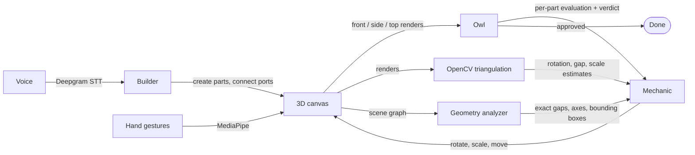

# Workshop

**A multi-agent spatial perception framework.** You say "build me a rocket." One agent builds it in 3D, a second looks at the result and judges whether it reads as a rocket, a third corrects the geometry, and the loop repeats until the assembly converges. No keyboard, no mouse, and no model anywhere in the system that was trained on 3D data.

> Spatial intelligence is not a property of a model. It's a property of a system.

Status: research prototype. The core loop works end to end. See [What works and what doesn't](#what-works-and-what-doesnt) for an honest account.

Built solo by [Jolie Abadir](https://www.jolieabadir.com/workshop), April 2026 to present.

---

## The idea

Large language models are bad at 3D. Ask one to place four parts of a rocket in space and it will give you confident coordinates that put the nose cone inside the fuselage. It has never seen a 3D scene; it has only read about them.

Workshop's bet is that you do not need a model that understands 3D. You need a system in which different kinds of perception check each other:

- a **semantic** channel that knows what a rocket is made of,
- a **visual** channel that can look at a render and say "that doesn't look right,"
- a **geometric** channel that can measure exactly how far apart two parts are and which way each one points.

No single channel is sufficient. Together, with a correction loop between them, the assembly converges. That is close to how embodied cognition describes spatial skill in people: it comes from the loop between acting, sensing, and correcting, not from an internal 3D model.

## How it works



### The three agents

| Agent | Job | Sees | Can do |
| --- | --- | --- | --- |
| **Builder** | Turns a spoken request into parts and connections. Always hot: every utterance goes straight to it, with no routing step. | The transcript, the canvas state, what you are pointing at | Create components, connect ports, group, move, rotate, scale, delete, speak |
| **Owl** | Looks at the scene and judges it against what you asked for. Evaluates every part, then gives an overall verdict. | Three rendered views, scene-graph measurements, your original request | Flag issues per part, approve or reject the assembly |
| **Mechanic** | Fixes what the Owl flagged. Rotation first, then scale, then position. | The Owl's evaluation, exact geometry, OpenCV estimates, the history of corrections already tried, your original request | Rotate, scale, move, reconnect, request a regenerated part |

All three are Claude models called through Next.js API routes. Which model runs which agent is set in [`src/core/config/agent-models.ts`](src/core/config/agent-models.ts).

### The correction loop

After the Builder finishes, [`useVisualFeedbackLoop`](src/hooks/useVisualFeedbackLoop.ts) runs up to five iterations of:

1. **Capture.** Render the scene from the front, side, and top ([`SceneCapture`](src/components/canvas/SceneCapture.tsx)).
2. **Measure in 2D.** A Python/OpenCV script ([`analyze.py`](src/app/api/cv-analyze/analyze.py)) finds each part's contour in each view, matches parts across views by color histogram, and triangulates rough 3D rotation, gap, and scale estimates.
3. **Measure in 3D.** The geometry analyzer ([`geometryAnalyzer.ts`](src/utils/geometryAnalyzer.ts)) reads the Three.js scene graph directly: bounding boxes, each part's principal axis, and the exact gap at every connection.
4. **Evaluate.** The Owl looks at the renders alongside those measurements and your original words.
5. **Stop or correct.** If the Owl approves, the loop ends. Otherwise the Mechanic issues corrections, duplicates of earlier corrections are filtered out so it cannot oscillate forever, and the fixes are applied to the canvas.

### Why the Builder never computes coordinates

An LLM cannot reliably do 3D arithmetic, so Workshop does not ask it to. Parts are **parametric components with typed connector ports**. The Builder creates every part at the origin and then says which port connects to which:

```
create_component  cone      "nose cone"
create_component  cylinder  "fuselage"
create_connection nose_cone.base -> fuselage.top
```

The canvas store does the math: `addConnection` repositions the target part so the two ports meet. The order of connections determines the final shape, so the Builder chains outward from an anchor part. Assembly becomes a graph problem the language model is good at, and the geometry is handled by code that is always right.

There are 23 component types ([`src/components/canvas/generators/`](src/components/canvas/generators)):

- **Geometric primitives:** cone, sphere, hemisphere, cylinder, torus, wedge, tube, fin, nozzle, dome
- **Mechanical:** plate, shaft, bearing, bracket, link, joint, housing, gear
- **Electronic:** resistor, capacitor, IC, LED, connector

### Hands and voice

- **Voice.** Deepgram streaming speech-to-text. When you stop speaking, the transcript goes to the Builder and the mic pauses until it has acted. Replies are spoken back.
- **Right hand** (MediaPipe): interact. Pinch to grab and drag, and a resize gesture to scale a part.
- **Left hand:** navigate. Orbit and zoom the camera.
- Both hands share one webcam stream. Parts you touch go onto a focus stack, so "make *this* bigger" resolves to the thing you last handled.

## What I learned building it

These are the parts I would want to read if this were someone else's repo.

**Mixed perceptual channels cause convergence failures.** Early on, corrections oscillated: a part rotated 90° one way, then back, then again. The cause was agents sharing inputs. When the correcting agent is handed both screenshots and numbers, the image tends to win, even when the numbers are exact and the image is ambiguous. The fix was to be deliberate about which agent gets which channel: the Owl owns vision, and the Mechanic is told to trust the scene-graph measurements and CV estimates over its own visual impression.

**Generated meshes were the wrong foundation.** The first version asked a text-to-3D service (Tripo) for every part. The meshes arrived with arbitrary orientation, inflated invisible geometry that broke bounding boxes, and no notion of where they should attach to anything. Most of the April 11 to 13 commit history is me fighting that. Switching to parametric primitives with typed ports turned assembly into something the system could reason about, and the rocket came out right on the first build. Mesh generation is still in the repo (`generate_mesh`, with a SHA-256 prompt cache so repeats are instant and free) as a future "visual wrap" for organic shapes.

**The evaluators never saw the request.** For a while the Owl and Mechanic judged the scene with no idea what the user had asked for. They approved assemblies that were well formed and wrong. Both now receive the original transcript.

**A naming mismatch silently disabled triangulation for two days.** Frames were saved as `frame_0/1/2` while the OpenCV script looked for `front/side/top`. Nothing errored. The geometric channel was just empty, and the loop quietly got worse. Lesson: a perception channel that fails should fail loudly.

**Titles versus IDs.** The Builder referred to parts by title, the connection code looked them up by ID, and auto-alignment never ran. One resolver function fixed a bug that took two days to see. There is now per-iteration diagnostic logging of every perception layer, which is how it was finally found.

**A scale clamp blocked convergence.** A minimum scale of 0.3 meant the Mechanic could ask for a smaller part and never get one, so the Owl never approved.

## What works and what doesn't

**Works**
- Voice to Builder to canvas, in about a second
- Two-hand tracking: grab, drag, resize, orbit, zoom
- Parametric components with port-based auto-alignment
- Three-view capture, OpenCV multi-view analysis, scene-graph geometry analysis
- The Owl → Mechanic loop with loop detection and correction history
- On well-formed assemblies, open issues went from 3 to 1 in 2 iterations

**Known limits**
- The Builder sometimes under-connects: for a four-part rocket it may emit one connection where three are needed.
- The OpenCV channel matches parts across views by color, so two parts with the same color confuse it.
- Evaluation so far is on a small number of objects, by me. There is no user study and no ablation yet.
- Three more agents are sketched in [`CLAUDE.md`](CLAUDE.md) (a researcher, a safety supervisor, a manager that queues corrections for natural pauses). Only the safety logger exists; the rest are empty files.
- Costs real API money to run. Every loop iteration is a vision call plus a correction call.

## Running it

You need Node 20+, Python 3 with OpenCV, a webcam, a microphone, and two API keys.

```bash
git clone https://github.com/Jolieabadir/workshop.git
cd workshop
npm install
pip install -r src/app/api/cv-analyze/requirements.txt

cp .env.example .env.local   # then fill in the keys
npm run dev                  # http://localhost:3000
```

| Variable | Required | For |
| --- | --- | --- |
| `ANTHROPIC_API_KEY` | yes | All three agents |
| `DEEPGRAM_API_KEY` | yes | Speech-to-text and text-to-speech |
| `TRIPO_API_KEY` | no | Optional AI mesh generation |

Keys stay server-side in the Next.js API routes. Use Chrome; MediaPipe's hand tracking and `getUserMedia` behave best there. Allow camera and microphone access when asked, then try:

> "Build me a rocket."

and press **Fix Assembly** to watch the Owl and Mechanic work.

## Project layout

```
src/
├── agents/            prompts and tool definitions for builder, owl, mechanic
├── app/api/
│   ├── agent/         Builder: multi-round tool calling
│   ├── agents/owl/    visual evaluation
│   ├── agents/mechanic/  spatial correction
│   ├── cv-analyze/    Node route + analyze.py (OpenCV multi-view triangulation)
│   ├── mesh/          Tripo proxy with on-disk GLB cache
│   └── speech/        Deepgram streaming proxy
├── components/canvas/ R3F scene, hand trackers, scene capture, agent avatars
│   └── generators/    the 23 parametric components
├── components/hud/    transcript bar, agent status, audit log
├── hooks/             voice pipeline, intent dispatch, visual feedback loop
├── input/             merges voice + gesture + mouse into one intent stream
├── pipeline/          agent loop
├── store/             Zustand: canvas, hands, input, audit log
└── utils/             geometryAnalyzer.ts (scene-graph measurements)
```

## Stack

Next.js 16 · React 19 · TypeScript · React Three Fiber + drei · Three.js · Zustand · Anthropic Claude API (tool use and vision) · Deepgram · MediaPipe Tasks Vision · OpenCV (Python) · Tailwind

## Where this is going

- Give the Mechanic purely numeric input and measure whether convergence improves, as a proper ablation of the channel-separation idea
- Fix Builder under-connection
- A spatial learning cache: remember which corrections worked for which kinds of parts
- Evaluate on a fixed set of objects with a repeatable metric, then with other people

## Related

Workshop is one of several projects on [jolieabadir.com](https://www.jolieabadir.com). The development process behind it, a structured build log and a study of where LLM-assisted development fails, is written up [here](https://www.jolieabadir.com/context-management).
